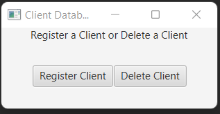
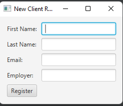
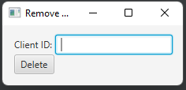
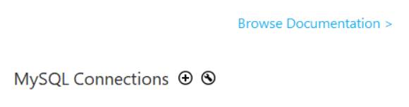
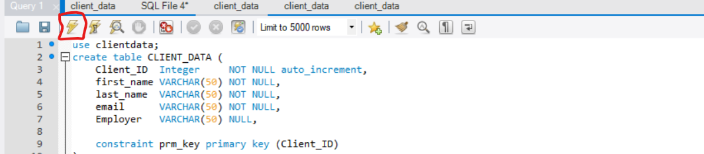

# Client Database Example
This is an idea and project I wanted to accomplish in order to gain a better understanding of full stack development as a novice developer. Thoughout building this project,
I gained a better understanding of how Java can be used to obtain data, and insert data into a MySQL database.
## Desciption
&nbsp; &nbsp; &nbsp; This program was specifically coded in IntelliJ and the build instructions are intended for the IntelliJ IDE running on a 64 bit version of windows.

&nbsp; &nbsp; &nbsp; The purpose is to demonstrate a basic example of full stack development. The backend is programmed using JDBC, and SQL.
The front end is coded using JavaFX. The idea behind this software is to pretend you work for a company, and you're responsible for registering new clients to the database, and
also removing them.    

&nbsp; &nbsp; &nbsp; How this happens is when the program is started, the user is prompted to select whether they would like to register a new client to the database or remove a client.
If you select register a client, then you will be prompted to enter the first name, last name, email, and employer for the client info. If you select to delete a client then you
will be taken to a new window where you can enter the "Client_ID." At this point, if you press the delete button, then that specific client's info will be deleted from the database.
# Build Instructions
## MySQL Workbench Setup + Connecting Database
### Step 1 - Windows: 
[This is a link to the youtube video I used to install and use MySQL workbench] (https://www.youtube.com/watch?v=u96rVINbAUI) I believe this is the simplist way to get it up and running
for the purpose of this project.
### Step 2: 
Once in MySQL Workbench, There will be a plus icon towards the middle left of the page, right next to MySQL Connections. Click that button, and you will be prompted to 
create a new connection.
### Step 3:
Make sure the name of the database is named "ClientData". The password can be unique but where you see the Your_MySQL_Password field in the java code, you
must replace it with the password you created in order for it to work. **Make your password easy to remember if you can.**
### Step 4:
Once in the connected database. Go to the repository and open the CLIENT_DATA.sql file. Opening this file after cloning the repository **may** automatically open the file in MySQL workbench.
I recommend just copying and pasting the contents into a new SQL file within your ClientData database. Then running the code by clicking the lightning icon next to the save button. 
## Connecting Database
### Step 1: 
In the lib folder within the repository, there is a jar file that assists with connecting the JDBC framework to the actual database in MySQL. Once the project is loaded
in IntelliJ, You have to go to File -> Project Structure -> Modules -> "+" sign at the bottom -> JARS or Directories. And then select the jar file that is in the lib folder.
### Step 2: 
Replace all 3 instances of "Your_MySQL_Password" with your actual MySQL password. (Line 75 in Main, Line 59 in NewClientStage, Line 53 in RemoveClientStage)
### Step 3:
If connecting the database to IntelliJ gets confusing while following these steps then I recommend watching **this video** (https://www.youtube.com/watch?v=e8g9eNnFpHQ&t=193s)tps://www.youtube.com/watch?v=e8g9eNnFpHQ&t=193s).com/watch?v=e8g9eNnFpHQ&t=193s)
## Setting Up JavaFX
### Step 1:
Go to [this link] (https://gluonhq.com/products/javafx/) to dowload the JavaFX library and [this link] (https://www.youtube.com/watch?v=WDaXpDtYk3E) for instructions when
installing on windows OS. **Some of the steps below are shown in the youtube video above so you may not need to repeat some of these steps.**
### Step 2:
I recommend moving JavaFX SDK folder from the downloads folder to somewhere in the program files folder that's easy to remember.
### Step 3:
Once in IntelliJ, go to File -> Project Structure -> Libraries -> "+" at the top towards the left -> Java -> Then input the path to the downloaded JavaFX file
### Step 4:
Go to Run -> Edit Configurations -> Modify options (highlighted in blue, top right) -> Add VM Options
### Step 5: 
Next insert this command within the field under Modify options. And make sure the file path is set to where your JavaFX lib folder is located in your file system.
```
--module-path "Your path to the JavaFx lib folder" --add-modules javafx.controls,javafx.fxml
```
### Step 6:
Click apply and then you should be ready to run JavaFX, and connect to your own database consisting of 1000 client data entries! :+1: (All of this data is completly fake and
generated from a website called mockaroo (https://www.mockaroo.com/))

# Future Updates
In the future, I would like to add a feature that allows a user to search the data base via Client_ID and then return a new window with the Clients information.
